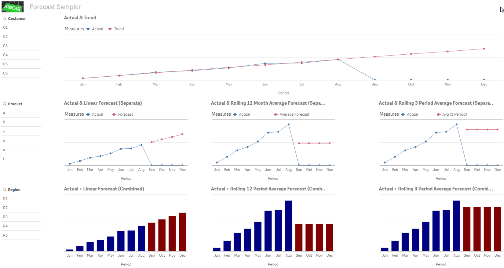

# Forecast Sampler
An example Qlik Sense application that demonstrates forecasting capabilities.
>  

# Implementation
**For Qlik Sense Desktop:**
1. Download the [Forecast Sampler.qvf](https://github.com/newmans99/Forecast-Sampler/raw/master/Forecast Sampler.qvf) file.
2. Save the downloaded file to your "...\My Documents\Qlik\Apps" folder.
3. From Qlik Sense Desktop Hub, open the "Forecast Sampler" app and interact/review the Forecast Sampler Sheet.

**For Qlik Sense Server:**
1. Download the ["Forecast Sampler.qvf"](https://github.com/newmans99/Forecast-Sampler/raw/master/Forecast Sampler.qvf) file
2. From QMC, upload the downlaoded app.
3. From Qlik Sense Hub, open the "Forecast Sampler" app and interact/review the Forecast Sampler Sheet.

# Use
You can re-load the app at any time, reloading the app will create new sample data based on today's date and will forecast through the rest of the year. The load script has been provided separately so that you can copy and paste it into your application. The variables are used in the app for the Master Items for easy reuse and portability.

# Calculation Information:
The calcualtions in this app were derived from this [Qlik Community article](https://community.qlik.com/thread/16846), there were updated for Qlik Sense and parameterized for the load script to make it more dynamic. Future versions of this readme will provide more details about the calculations themselves.

# Please help...
Please provide any comments or suggestions, specifically, I am looking for errors or problems in the calculations.

# Remaining items, I would like to add for future versions...
See Github Issues

# License
Released under the MIT license.
